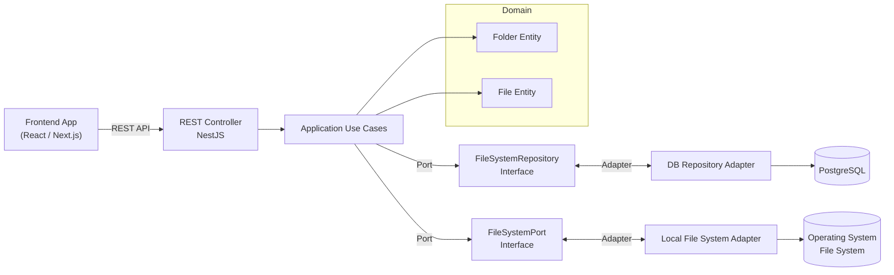

# File System Management Application - Development Guide

## Table of Contents
- [Overview](#overview)
- [Architecture](#architecture)
- [Technology Stack](#technology-stack)
- [Project Structure](#project-structure)
- [Development Phases](#development-phases)
- [Docker Configuration](#docker-configuration)
- [DTOs and Validation](#dtos-and-validation)
- [API Endpoints](#api-endpoints)
- [Development Setup](#development-setup)
- [Testing Strategy](#testing-strategy)

---

## Overview

A full-stack file system management application built with hexagonal architecture (ports and adapters pattern) that allows users to organize files and folders through a web interface.

### Key Features
- Hierarchical folder structure
- File upload/download with drag-and-drop
- Move files and folders
- File preview
- Search functionality
- Responsive UI

---

## Architecture

### Hexagonal Architecture Diagram



### Architecture Layers

1. **Domain Layer** (Core)
   - Business entities (Folder, File)
   - Business logic and rules
   - No external dependencies

2. **Application Layer**
   - Use cases (CreateFolder, UploadFile, etc.)
   - Port interfaces
   - Orchestrates domain objects

3. **Infrastructure Layer**
   - Adapters (Database, File System)
   - External service implementations
   - Frameworks and tools

4. **Presentation Layer**
   - REST Controllers
   - DTOs with validation
   - HTTP layer

---

## Technology Stack

### Backend
- **Framework**: NestJS (TypeScript)
- **Database**: PostgreSQL 15
- **ORM**: TypeORM / Prisma
- **Validation**: class-validator, class-transformer
- **File Upload**: Multer
- **Authentication**: JWT (Passport)

### Frontend
- **Framework**: Next.js 14+ (App Router)
- **UI Library**: React 18
- **Styling**: Tailwind CSS
- **State Management**: Zustand / React Query
- **File Upload**: react-dropzone
- **HTTP Client**: Axios / Fetch API

### DevOps
- **Containerization**: Docker, Docker Compose
- **Database Admin**: pgAdmin 4
- **Package Manager**: npm / pnpm

---

## Project Structure

```
filesystem-app/
├── backend/
│   ├── src/
│   │   ├── domain/
│   │   │   ├── entities/
│   │   │   │   ├── folder.entity.ts
│   │   │   │   └── file.entity.ts
│   │   │   ├── value-objects/
│   │   │   └── exceptions/
│   │   │
│   │   ├── application/
│   │   │   ├── ports/
│   │   │   │   ├── filesystem-repository.port.ts
│   │   │   │   └── filesystem.port.ts
│   │   │   └── use-cases/
│   │   │       ├── folder/
│   │   │       │   ├── create-folder.use-case.ts
│   │   │       │   ├── delete-folder.use-case.ts
│   │   │       │   ├── move-folder.use-case.ts
│   │   │       │   ├── update-folder.use-case.ts
│   │   │       │   └── list-folders.use-case.ts
│   │   │       └── file/
│   │   │           ├── upload-file.use-case.ts
│   │   │           ├── delete-file.use-case.ts
│   │   │           ├── move-file.use-case.ts
│   │   │           ├── download-file.use-case.ts
│   │   │           └── list-files.use-case.ts
│   │   │
│   │   ├── infrastructure/
│   │   │   ├── adapters/
│   │   │   │   ├── persistence/
│   │   │   │   │   ├── typeorm/
│   │   │   │   │   │   ├── entities/
│   │   │   │   │   │   ├── repositories/
│   │   │   │   │   │   └── migrations/
│   │   │   │   │   └── filesystem-repository.adapter.ts
│   │   │   │   └── filesystem/
│   │   │   │       └── local-filesystem.adapter.ts
│   │   │   └── config/
│   │   │       ├── database.config.ts
│   │   │       └── app.config.ts
│   │   │
│   │   ├── presentation/
│   │   │   ├── controllers/
│   │   │   │   ├── folder.controller.ts
│   │   │   │   └── file.controller.ts
│   │   │   ├── dtos/
│   │   │   │   ├── folder/
│   │   │   │   │   ├── create-folder.dto.ts
│   │   │   │   │   ├── update-folder.dto.ts
│   │   │   │   │   ├── move-folder.dto.ts
│   │   │   │   │   └── query-folder.dto.ts
│   │   │   │   └── file/
│   │   │   │       ├── upload-file.dto.ts
│   │   │   │       ├── update-file.dto.ts
│   │   │   │       ├── move-file.dto.ts
│   │   │   │       └── query-file.dto.ts
│   │   │   ├── validators/
│   │   │   ├── filters/
│   │   │   └── interceptors/
│   │   │
│   │   ├── app.module.ts
│   │   └── main.ts
│   │
│   ├── test/
│   ├── package.json
│   ├── tsconfig.json
│   ├── nest-cli.json
│   └── .env
│
├── frontend/
│   ├── src/
│   │   ├── app/
│   │   │   ├── (auth)/
│   │   │   ├── (dashboard)/
│   │   │   ├── layout.tsx
│   │   │   └── page.tsx
│   │   ├── components/
│   │   │   ├── ui/
│   │   │   ├── folder-tree/
│   │   │   ├── file-list/
│   │   │   ├── file-upload/
│   │   │   └── file-preview/
│   │   ├── lib/
│   │   │   ├── api/
│   │   │   ├── hooks/
│   │   │   └── utils/
│   │   ├── store/
│   │   └── types/
│   │
│   ├── public/
│   ├── package.json
│   ├── tsconfig.json
│   ├── next.config.js
│   ├── tailwind.config.js
│   └── .env.local
│
├── docker-compose.yml
├── .gitignore
└── README.md
```

---

## Development Phases

### Phase 1: Infrastructure Setup ⚙️

#### 1.1 Docker Configuration
- Create `docker-compose.yml` with PostgreSQL
- Add pgAdmin for database management
- Configure environment variables
- Set up volume persistence

#### 1.2 Project Initialization
```bash
# Backend
npx @nestjs/cli new backend
cd backend
npm install @nestjs/typeorm typeorm pg
npm install class-validator class-transformer
npm install @nestjs/config
npm install -D @types/multer

# Frontend
npx create-next-app@latest frontend --typescript --tailwind --app
cd frontend
npm install axios react-query zustand
npm install react-dropzone
npm install lucide-react
```

---

### Phase 2: Domain Layer 🎯

#### 2.1 Create Domain Entities

**Folder Entity**
```typescript
// domain/entities/folder.entity.ts
export class Folder {
  constructor(
    public readonly id: string,
    public name: string,
    public readonly parentId: string | null,
    public readonly userId: string,
    public readonly createdAt: Date,
    public updatedAt: Date,
  ) {}

  rename(newName: string): void {
    if (!newName || newName.trim().length === 0) {
      throw new Error('Folder name cannot be empty');
    }
    if (!/^[^/\\:*?"<>|]+$/.test(newName)) {
      throw new Error('Folder name contains invalid characters');
    }
    this.name = newName;
    this.updatedAt = new Date();
  }

  isRoot(): boolean {
    return this.parentId === null;
  }
}
```

**File Entity**
```typescript
// domain/entities/file.entity.ts
export class File {
  constructor(
    public readonly id: string,
    public name: string,
    public readonly folderId: string | null,
    public readonly userId: string,
    public readonly size: number,
    public readonly mimeType: string,
    public readonly path: string,
    public readonly createdAt: Date,
    public updatedAt: Date,
  ) {}

  rename(newName: string): void {
    if (!newName || newName.trim().length === 0) {
      throw new Error('File name cannot be empty');
    }
    if (!/^[^/\\:*?"<>|]+$/.test(newName)) {
      throw new Error('File name contains invalid characters');
    }
    this.name = newName;
    this.updatedAt = new Date();
  }

  getExtension(): string {
    return this.name.split('.').pop() || '';
  }

  isImage(): boolean {
    return this.mimeType.startsWith('image/');
  }
}
```

#### 2.2 Domain Exceptions
```typescript
// domain/exceptions/folder-not-found.exception.ts
export class FolderNotFoundException extends Error {
  constructor(folderId: string) {
    super(`Folder with ID ${folderId} not found`);
  }
}

// domain/exceptions/file-not-found.exception.ts
export class FileNotFoundException extends Error {
  constructor(fileId: string) {
    super(`File with ID ${fileId} not found`);
  }
}
```

---

### Phase 3: Application Layer 🔧

#### 3.1 Define Ports (Interfaces)

**FileSystem Repository Port**
```typescript
// application/ports/filesystem-repository.port.ts
import { Folder } from '../../domain/entities/folder.entity';
import { File } from '../../domain/entities/file.entity';

export interface IFileSystemRepository {
  // Folder operations
  createFolder(folder: Folder): Promise<Folder>;
  findFolderById(id: string): Promise<Folder | null>;
  findFoldersByParentId(parentId: string | null, userId: string): Promise<Folder[]>;
  updateFolder(folder: Folder): Promise<Folder>;
  deleteFolder(id: string): Promise<void>;
  
  // File operations
  createFile(file: File): Promise<File>;
  findFileById(id: string): Promise<File | null>;
  findFilesByFolderId(folderId: string | null, userId: string): Promise<File[]>;
  updateFile(file: File): Promise<File>;
  deleteFile(id: string): Promise<void>;
  searchFiles(query: string, userId: string): Promise<File[]>;
}
```

**FileSystem Port**
```typescript
// application/ports/filesystem.port.ts
export interface IFileSystem {
  saveFile(path: string, buffer: Buffer): Promise<void>;
  readFile(path: string): Promise<Buffer>;
  deleteFile(path: string): Promise<void>;
  moveFile(sourcePath: string, destinationPath: string): Promise<void>;
  fileExists(path: string): Promise<boolean>;
}
```

#### 3.2 Create Use Cases

**Create Folder Use Case**
```typescript
// application/use-cases/folder/create-folder.use-case.ts
import { Injectable } from '@nestjs/common';
import { Folder } from '../../../domain/entities/folder.entity';
import { IFileSystemRepository } from '../../ports/filesystem-repository.port';
import { v4 as uuidv4 } from 'uuid';

export interface CreateFolderCommand {
  name: string;
  parentId?: string;
  userId: string;
}

@Injectable()
export class CreateFolderUseCase {
  constructor(
    private readonly repository: IFileSystemRepository,
  ) {}

  async execute(command: CreateFolderCommand): Promise<Folder> {
    const folder = new Folder(
      uuidv4(),
      command.name,
      command.parentId || null,
      command.userId,
      new Date(),
      new Date(),
    );

    return await this.repository.createFolder(folder);
  }
}
```

**Upload File Use Case**
```typescript
// application/use-cases/file/upload-file.use-case.ts
import { Injectable } from '@nestjs/common';
import { File } from '../../../domain/entities/file.entity';
import { IFileSystemRepository } from '../../ports/filesystem-repository.port';
import { IFileSystem } from '../../ports/filesystem.port';
import { v4 as uuidv4 } from 'uuid';

export interface UploadFileCommand {
  name: string;
  folderId?: string;
  userId: string;
  buffer: Buffer;
  mimeType: string;
  size: number;
}

@Injectable()
export class UploadFileUseCase {
  constructor(
    private readonly repository: IFileSystemRepository,
    private readonly fileSystem: IFileSystem,
  ) {}

  async execute(command: UploadFileCommand): Promise<File> {
    const fileId = uuidv4();
    const path = `uploads/${command.userId}/${fileId}`;

    // Save physical file
    await this.fileSystem.saveFile(path, command.buffer);

    // Save metadata to database
    const file = new File(
      fileId,
      command.name,
      command.folderId || null,
      command.userId,
      command.size,
      command.mimeType,
      path,
      new Date(),
      new Date(),
    );

    return await this.repository.createFile(file);
  }
}
```

---

### Phase 4: Infrastructure Layer 🏗️

#### 4.1 Database Adapter (TypeORM)

**TypeORM Entities**
```typescript
// infrastructure/adapters/persistence/typeorm/entities/folder.typeorm-entity.ts
import { Entity, Column, PrimaryColumn, ManyToOne, OneToMany, CreateDateColumn, UpdateDateColumn } from 'typeorm';

@Entity('folders')
export class FolderTypeOrmEntity {
  @PrimaryColumn('uuid')
  id: string;

  @Column({ length: 255 })
  name: string;

  @Column({ type: 'uuid', nullable: true })
  parentId: string | null;

  @Column({ type: 'uuid' })
  userId: string;

  @CreateDateColumn()
  createdAt: Date;

  @UpdateDateColumn()
  updatedAt: Date;
}
```

```typescript
// infrastructure/adapters/persistence/typeorm/entities/file.typeorm-entity.ts
import { Entity, Column, PrimaryColumn, ManyToOne, CreateDateColumn, UpdateDateColumn } from 'typeorm';

@Entity('files')
export class FileTypeOrmEntity {
  @PrimaryColumn('uuid')
  id: string;

  @Column({ length: 255 })
  name: string;

  @Column({ type: 'uuid', nullable: true })
  folderId: string | null;

  @Column({ type: 'uuid' })
  userId: string;

  @Column({ type: 'bigint' })
  size: number;

  @Column({ length: 100 })
  mimeType: string;

  @Column({ length: 500 })
  path: string;

  @CreateDateColumn()
  createdAt: Date;

  @UpdateDateColumn()
  updatedAt: Date;
}
```

**Repository Adapter**
```typescript
// infrastructure/adapters/persistence/filesystem-repository.adapter.ts
import { Injectable } from '@nestjs/common';
import { InjectRepository } from '@nestjs/typeorm';
import { Repository } from 'typeorm';
import { IFileSystemRepository } from '../../../application/ports/filesystem-repository.port';
import { Folder } from '../../../domain/entities/folder.entity';
import { File } from '../../../domain/entities/file.entity';
import { FolderTypeOrmEntity } from './typeorm/entities/folder.typeorm-entity';
import { FileTypeOrmEntity } from './typeorm/entities/file.typeorm-entity';

@Injectable()
export class FileSystemRepositoryAdapter implements IFileSystemRepository {
  constructor(
    @InjectRepository(FolderTypeOrmEntity)
    private readonly folderRepo: Repository<FolderTypeOrmEntity>,
    @InjectRepository(FileTypeOrmEntity)
    private readonly fileRepo: Repository<FileTypeOrmEntity>,
  ) {}

  async createFolder(folder: Folder): Promise<Folder> {
    const entity = this.folderRepo.create({
      id: folder.id,
      name: folder.name,
      parentId: folder.parentId,
      userId: folder.userId,
    });
    const saved = await this.folderRepo.save(entity);
    return this.toDomainFolder(saved);
  }

  async findFolderById(id: string): Promise<Folder | null> {
    const entity = await this.folderRepo.findOne({ where: { id } });
    return entity ? this.toDomainFolder(entity) : null;
  }

  // ... implement other methods

  private toDomainFolder(entity: FolderTypeOrmEntity): Folder {
    return new Folder(
      entity.id,
      entity.name,
      entity.parentId,
      entity.userId,
      entity.createdAt,
      entity.updatedAt,
    );
  }

  private toDomainFile(entity: FileTypeOrmEntity): File {
    return new File(
      entity.id,
      entity.name,
      entity.folderId,
      entity.userId,
      Number(entity.size),
      entity.mimeType,
      entity.path,
      entity.createdAt,
      entity.updatedAt,
    );
  }
}
```

#### 4.2 File System Adapter

```typescript
// infrastructure/adapters/filesystem/local-filesystem.adapter.ts
import { Injectable } from '@nestjs/common';
import { promises as fs } from 'fs';
import * as path from 'path';
import { IFileSystem } from '../../../application/ports/filesystem.port';

@Injectable()
export class LocalFileSystemAdapter implements IFileSystem {
  private readonly uploadDir = path.join(process.cwd(), 'uploads');

  async saveFile(filePath: string, buffer: Buffer): Promise<void> {
    const fullPath = path.join(this.uploadDir, filePath);
    const dir = path.dirname(fullPath);
    
    await fs.mkdir(dir, { recursive: true });
    await fs.writeFile(fullPath, buffer);
  }

  async readFile(filePath: string): Promise<Buffer> {
    const fullPath = path.join(this.uploadDir, filePath);
    return await fs.readFile(fullPath);
  }

  async deleteFile(filePath: string): Promise<void> {
    const fullPath = path.join(this.uploadDir, filePath);
    await fs.unlink(fullPath);
  }

  async moveFile(sourcePath: string, destinationPath: string): Promise<void> {
    const fullSourcePath = path.join(this.uploadDir, sourcePath);
    const fullDestPath = path.join(this.uploadDir, destinationPath);
    
    await fs.mkdir(path.dirname(fullDestPath), { recursive: true });
    await fs.rename(fullSourcePath, fullDestPath);
  }

  async fileExists(filePath: string): Promise<boolean> {
    try {
      const fullPath = path.join(this.uploadDir, filePath);
      await fs.access(fullPath);
      return true;
    } catch {
      return false;
    }
  }
}
```

---

### Phase 5: Presentation Layer 🎨

#### 5.1 DTOs with Validation

**Folder DTOs**
```typescript
// presentation/dtos/folder/create-folder.dto.ts
import { IsString, IsNotEmpty, IsUUID, IsOptional, MaxLength, Matches } from 'class-validator';

export class CreateFolderDto {
  @IsString()
  @IsNotEmpty({ message: 'Folder name is required' })
  @MaxLength(255, { message: 'Folder name cannot exceed 255 characters' })
  @Matches(/^[^/\\:*?"<>|]+$/, { message: 'Folder name contains invalid characters' })
  name: string;

  @IsOptional()
  @IsUUID('4', { message: 'Parent folder ID must be a valid UUID' })
  parentId?: string;
}
```

```typescript
// presentation/dtos/folder/update-folder.dto.ts
import { IsString, IsNotEmpty, MaxLength, Matches } from 'class-validator';

export class UpdateFolderDto {
  @IsString()
  @IsNotEmpty({ message: 'Folder name is required' })
  @MaxLength(255, { message: 'Folder name cannot exceed 255 characters' })
  @Matches(/^[^/\\:*?"<>|]+$/, { message: 'Folder name contains invalid characters' })
  name: string;
}
```

```typescript
// presentation/dtos/folder/move-folder.dto.ts
import { IsUUID, IsOptional } from 'class-validator';

export class MoveFolderDto {
  @IsOptional()
  @IsUUID('4', { message: 'Target folder ID must be a valid UUID' })
  targetFolderId?: string;
}
```

```typescript
// presentation/dtos/folder/query-folder.dto.ts
import { IsOptional, IsInt, Min, Max, IsEnum, IsUUID } from 'class-validator';
import { Type } from 'class-transformer';

enum SortOrder {
  ASC = 'ASC',
  DESC = 'DESC',
}

enum SortBy {
  NAME = 'name',
  CREATED_AT = 'createdAt',
  UPDATED_AT = 'updatedAt',
}

export class QueryFolderDto {
  @IsOptional()
  @IsUUID('4')
  parentId?: string;

  @IsOptional()
  @Type(() => Number)
  @IsInt()
  @Min(1)
  @Max(100)
  limit?: number = 20;

  @IsOptional()
  @Type(() => Number)
  @IsInt()
  @Min(0)
  offset?: number = 0;

  @IsOptional()
  @IsEnum(SortBy)
  sortBy?: SortBy = SortBy.NAME;

  @IsOptional()
  @IsEnum(SortOrder)
  sortOrder?: SortOrder = SortOrder.ASC;
}
```

**File DTOs**
```typescript
// presentation/dtos/file/upload-file.dto.ts
import { IsString, IsNotEmpty, IsUUID, IsOptional, MaxLength, Matches } from 'class-validator';

export class UploadFileDto {
  @IsString()
  @IsNotEmpty({ message: 'File name is required' })
  @MaxLength(255, { message: 'File name cannot exceed 255 characters' })
  @Matches(/^[^/\\:*?"<>|]+$/, { message: 'File name contains invalid characters' })
  name: string;

  @IsOptional()
  @IsUUID('4', { message: 'Folder ID must be a valid UUID' })
  folderId?: string;
}
```

```typescript
// presentation/dtos/file/update-file.dto.ts
import { IsString, IsNotEmpty, MaxLength, Matches } from 'class-validator';

export class UpdateFileDto {
  @IsString()
  @IsNotEmpty({ message: 'File name is required' })
  @MaxLength(255, { message: 'File name cannot exceed 255 characters' })
  @Matches(/^[^/\\:*?"<>|]+$/, { message: 'File name contains invalid characters' })
  name: string;
}
```

```typescript
// presentation/dtos/file/move-file.dto.ts
import { IsUUID, IsOptional } from 'class-validator';

export class MoveFileDto {
  @IsOptional()
  @IsUUID('4', { message: 'Target folder ID must be a valid UUID' })
  targetFolderId?: string;
}
```

```typescript
// presentation/dtos/file/query-file.dto.ts
import { IsOptional, IsInt, Min, Max, IsEnum, IsUUID, IsString } from 'class-validator';
import { Type } from 'class-transformer';

enum FileSortBy {
  NAME = 'name',
  SIZE = 'size',
  CREATED_AT = 'createdAt',
  UPDATED_AT = 'updatedAt',
}

enum SortOrder {
  ASC = 'ASC',
  DESC = 'DESC',
}

export class QueryFileDto {
  @IsOptional()
  @IsUUID('4')
  folderId?: string;

  @IsOptional()
  @IsString()
  search?: string;

  @IsOptional()
  @IsString()
  mimeType?: string;

  @IsOptional()
  @Type(() => Number)
  @IsInt()
  @Min(1)
  @Max(100)
  limit?: number = 20;

  @IsOptional()
  @Type(() => Number)
  @IsInt()
  @Min(0)
  offset?: number = 0;

  @IsOptional()
  @IsEnum(FileSortBy)
  sortBy?: FileSortBy = FileSortBy.NAME;

  @IsOptional()
  @IsEnum(SortOrder)
  sortOrder?: SortOrder = SortOrder.ASC;
}
```

#### 5.2 Controllers

**Folder Controller**
```typescript
// presentation/controllers/folder.controller.ts
import {
  Controller,
  Get,
  Post,
  Put,
  Delete,
  Body,
  Param,
  Query,
  ParseUUIDPipe,
  HttpCode,
  HttpStatus,
} from '@nestjs/common';
import {
  CreateFolderDto,
  UpdateFolderDto,
  MoveFolderDto,
  QueryFolderDto,
} from '../dtos/folder';
import { CreateFolderUseCase } from '../../application/use-cases/folder/create-folder.use-case';
import { UpdateFolderUseCase } from '../../application/use-cases/folder/update-folder.use-case';
import { DeleteFolderUseCase } from '../../application/use-cases/folder/delete-folder.use-case';
import { MoveFolderUseCase } from '../../application/use-cases/folder/move-folder.use-case';
import { ListFoldersUseCase } from '../../application/use-cases/folder/list-folders.use-case';

@Controller('api/folders')
export class FolderController {
  constructor(
    private readonly createFolderUseCase: CreateFolderUseCase,
    private readonly updateFolderUseCase: UpdateFolderUseCase,
    private readonly deleteFolderUseCase: DeleteFolderUseCase,
    private readonly moveFolderUseCase: MoveFolderUseCase,
    private readonly listFoldersUseCase: ListFoldersUseCase,
  ) {}

  @Post()
  @HttpCode(HttpStatus.CREATED)
  async create(@Body() dto: CreateFolderDto) {
    return this.createFolderUseCase.execute({
      name: dto.name,
      parentId: dto.parentId,
      userId: 'temp-user-id', // Replace with actual user from auth
    });
  }

  @Get()
  async findAll(@Query() query: QueryFolderDto) {
    return this.listFoldersUseCase.execute({
      parentId: query.parentId,
      userId: 'temp-user-id', // Replace with actual user from auth
      limit: query.limit,
      offset: query.offset,
      sortBy: query.sortBy,
      sortOrder: query.sortOrder,
    });
  }

  @Put(':id')
  async update(
    @Param('id', ParseUUIDPipe) id: string,
    @Body() dto: UpdateFolderDto,
  ) {
    return this.updateFolderUseCase.execute({
      id,
      name: dto.name,
      userId: 'temp-user-id',
    });
  }

  @Put(':id/move')
  async move(
    @Param('id', ParseUUIDPipe) id: string,
    @Body() dto: MoveFolderDto,
  ) {
    return this.moveFolderUseCase.execute({
      id,
      targetFolderId: dto.targetFolderId,
      userId: 'temp-user-id',
    });
  }

  @Delete(':id')
  @HttpCode(HttpStatus.NO_CONTENT)
  async remove(@Param('id', ParseUUIDPipe) id: string) {
    await this.deleteFolderUseCase.execute({
      id,
      userId: 'temp-user-id',
    });
  }
}
```

**File Controller**
```typescript
// presentation/controllers/file.controller.ts
import {
  Controller,
  Get,
  Post,
  Put,
  Delete,
  Body,
  Param,
  Query,
  ParseUUIDPipe,
  UseInterceptors,
  UploadedFile,
  ParseFilePipe,
  MaxFileSizeValidator,
  FileTypeValidator,
  HttpCode,
  HttpStatus,
  StreamableFile,
  Response,
} from '@nestjs/common';
import { FileInterceptor } from '@nestjs/platform-express';
import { Response as ExpressResponse } from 'express';
import {
  UploadFileDto,
  UpdateFileDto,
  MoveFileDto,
  QueryFileDto,
} from '../dtos/file';
import { UploadFileUseCase } from '../../application/use-cases/file/upload-file.use-case';
import { UpdateFileUseCase } from '../../application/use-cases/file/update-file.use-case';
import { DeleteFileUseCase } from '../../application/use-cases/file/delete-file.use-case';
import { MoveFileUseCase } from '../../application/use-cases/file/move-file.use-case';
import { ListFilesUseCase } from '../../application/use-cases/file/list-files.use-case';
import { DownloadFileUseCase } from '../../application/use-cases/file/download-file.use-case';

@Controller('api/files')
export class FileController {
  constructor(
    private readonly uploadFileUseCase: UploadFileUseCase,
    private readonly updateFileUseCase: UpdateFileUseCase,
    private readonly deleteFileUseCase: DeleteFileUseCase,
    private readonly moveFileUseCase: MoveFileUseCase,
    private readonly listFilesUseCase: ListFilesUseCase,
    private readonly downloadFileUseCase: DownloadFileUseCase,
  ) {}

  @Post('upload')
  @HttpCode(HttpStatus.CREATED)
  @UseInterceptors(FileInterceptor('file'))
  async upload(
    @UploadedFile(
      new ParseFilePipe({
        validators: [
          new MaxFileSizeValidator({ maxSize: 100 * 1024 * 1024 }), // 100MB
        ],
      }),
    )
    file: Express.Multer.File,
    @Body() dto: UploadFileDto,
  ) {
    return this.uploadFileUseCase.execute({
      name: dto.name || file.originalname,
      folderId: dto.folderId,
      userId: 'temp-user-id',
      buffer: file.buffer,
      mimeType: file.mimetype,
      size: file.size,
    });
  }

  @Get()
  async findAll(@Query() query: QueryFileDto) {
    return this.listFilesUseCase.execute({
      folderId: query.folderId,
      userId: 'temp-user-id',
      search: query.search,
      mimeType: query.mimeType,
      limit: query.limit,
      offset: query.offset,
      sortBy: query.sortBy,
      sortOrder: query.sortOrder,
    });
  }

  @Get(':id/download')
  async download(
    @Param('id', ParseUUIDPipe) id: string,
    @Response({ passthrough: true }) res: ExpressResponse,
  ) {
    const { file, buffer } = await this.downloadFileUseCase.execute({
      id,
      userId: 'temp-user-id',
    });

    res.set({
      'Content-Type': file.mimeType,
      'Content-Disposition': `attachment; filename="${file.name}"`,
    });

    return new StreamableFile(buffer);
  }

  @Put(':id')
  async update(
    @Param('id', ParseUUIDPipe) id: string,
    @Body() dto: UpdateFileDto,
  ) {
    return this.updateFileUseCase.execute({
      id,
      name: dto.name,
      userId: 'temp-user-id',
    });
  }

  @Put(':id/move')
  async move(
    @Param('id', ParseUUIDPipe) id: string,
    @Body() dto: MoveFileDto,
  ) {
    return this.moveFileUseCase.execute({
      id,
      targetFolderId: dto.targetFolderId,
      userId: 'temp-user-id',
    });
  }

  @Delete(':id')
  @HttpCode(HttpStatus.NO_CONTENT)
  async remove(@Param('id', ParseUUIDPipe) id: string) {
    await this.deleteFileUseCase.execute({
      id,
      userId: 'temp-user-id',
    });
  }
}
```

#### 5.3 Global Validation Setup

```typescript
// main.ts
import { NestFactory } from '@nestjs/core';
import { ValidationPipe } from '@nestjs/common';
import { AppModule } from './app.module';

async function bootstrap() {
  const app = await NestFactory.create(AppModule);

  // Enable CORS
  app.enableCors({
    origin: process.env.FRONTEND_URL || 'http://localhost:3000',
    credentials: true,
  });

  // Global validation pipe
  app.useGlobalPipes(
    new ValidationPipe({
      whitelist: true,
      forbidNonWhitelisted: true,
      transform: true,
      transformOptions: {
        enableImplicitConversion: true,
      },
    }),
  );

  await app.listen(3001);
}
bootstrap();
```

---

### Phase 6: Frontend Development 💻

#### 6.1 API Client

```typescript
// frontend/src/lib/api/client.ts
import axios from 'axios';

export const apiClient = axios.create({
  baseURL: process.env.NEXT_PUBLIC_API_URL || 'http://localhost:3001/api',
  headers: {
    'Content-Type': 'application/json',
  },
});

// Add auth token interceptor
apiClient.interceptors.request.use((config) => {
  const token = localStorage.getItem('token');
  if (token) {
    config.headers.Authorization = `Bearer ${token}`;
  }
  return config;
});
```

```typescript
// frontend/src/lib/api/folders.ts
import { apiClient } from './client';

export interface Folder {
  id: string;
  name: string;
  parentId: string | null;
  userId: string;
  createdAt: string;
  updatedAt: string;
}

export const folderApi = {
  create: (data: { name: string; parentId?: string }) =>
    apiClient.post<Folder>('/folders', data),

  list: (params?: { parentId?: string; limit?: number; offset?: number }) =>
    apiClient.get<Folder[]>('/folders', { params }),

  update: (id: string, data: { name: string }) =>
    apiClient.put<Folder>(`/folders/${id}`, data),

  move: (id: string, data: { targetFolderId?: string }) =>
    apiClient.put<Folder>(`/folders/${id}/move`, data),

  delete: (id: string) =>
    apiClient.delete(`/folders/${id}`),
};
```

```typescript
// frontend/src/lib/api/files.ts
import { apiClient } from './client';

export interface File {
  id: string;
  name: string;
  folderId: string | null;
  userId: string;
  size: number;
  mimeType: string;
  path: string;
  createdAt: string;
  updatedAt: string;
}

export const fileApi = {
  upload: (file: File, data: { name?: string; folderId?: string }) => {
    const formData = new FormData();
    formData.append('file', file);
    if (data.name) formData.append('name', data.name);
    if (data.folderId) formData.append('folderId', data.folderId);

    return apiClient.post<File>('/files/upload', formData, {
      headers: { 'Content-Type': 'multipart/form-data' },
    });
  },

  list: (params?: {
    folderId?: string;
    search?: string;
    limit?: number;
    offset?: number;
  }) => apiClient.get<File[]>('/files', { params }),

  download: (id: string) =>
    apiClient.get(`/files/${id}/download`, { responseType: 'blob' }),

  update: (id: string, data: { name: string }) =>
    apiClient.put<File>(`/files/${id}`, data),

  move: (id: string, data: { targetFolderId?: string }) =>
    apiClient.put<File>(`/files/${id}/move`, data),

  delete: (id: string) =>
    apiClient.delete(`/files/${id}`),
};
```

#### 6.2 React Components

**Folder Tree Component**
```typescript
// frontend/src/components/folder-tree/FolderTree.tsx
'use client';

import { useState } from 'react';
import { useQuery } from '@tanstack/react-query';
import { folderApi, Folder } from '@/lib/api/folders';
import { ChevronRight, ChevronDown, Folder as FolderIcon } from 'lucide-react';

export function FolderTree() {
  const [expandedFolders, setExpandedFolders] = useState<Set<string>>(new Set());
  const [selectedFolder, setSelectedFolder] = useState<string | null>(null);

  const { data: rootFolders } = useQuery({
    queryKey: ['folders', null],
    queryFn: () => folderApi.list({ parentId: undefined }),
  });

  const toggleFolder = (folderId: string) => {
    const newExpanded = new Set(expandedFolders);
    if (newExpanded.has(folderId)) {
      newExpanded.delete(folderId);
    } else {
      newExpanded.add(folderId);
    }
    setExpandedFolders(newExpanded);
  };

  return (
    <div className="w-64 border-r bg-gray-50 p-4">
      <h2 className="text-lg font-semibold mb-4">Folders</h2>
      <div className="space-y-1">
        {rootFolders?.data.map((folder) => (
          <FolderItem
            key={folder.id}
            folder={folder}
            level={0}
            expanded={expandedFolders.has(folder.id)}
            selected={selectedFolder === folder.id}
            onToggle={() => toggleFolder(folder.id)}
            onSelect={() => setSelectedFolder(folder.id)}
          />
        ))}
      </div>
    </div>
  );
}

interface FolderItemProps {
  folder: Folder;
  level: number;
  expanded: boolean;
  selected: boolean;
  onToggle: () => void;
  onSelect: () => void;
}

function FolderItem({
  folder,
  level,
  expanded,
  selected,
  onToggle,
  onSelect,
}: FolderItemProps) {
  const { data: subFolders } = useQuery({
    queryKey: ['folders', folder.id],
    queryFn: () => folderApi.list({ parentId: folder.id }),
    enabled: expanded,
  });

  return (
    <div>
      <div
        className={`flex items-center gap-2 px-2 py-1.5 rounded cursor-pointer hover:bg-gray-200 ${
          selected ? 'bg-blue-100' : ''
        }`}
        style={{ paddingLeft: `${level * 16 + 8}px` }}
        onClick={onSelect}
      >
        <button onClick={(e) => { e.stopPropagation(); onToggle(); }}>
          {expanded ? (
            <ChevronDown className="w-4 h-4" />
          ) : (
            <ChevronRight className="w-4 h-4" />
          )}
        </button>
        <FolderIcon className="w-4 h-4 text-yellow-600" />
        <span className="text-sm">{folder.name}</span>
      </div>

      {expanded && subFolders?.data.map((subFolder) => (
        <FolderItem
          key={subFolder.id}
          folder={subFolder}
          level={level + 1}
          expanded={false}
          selected={false}
          onToggle={() => {}}
          onSelect={() => {}}
        />
      ))}
    </div>
  );
}
```

**File Upload Component**
```typescript
// frontend/src/components/file-upload/FileUpload.tsx
'use client';

import { useCallback } from 'react';
import { useDropzone } from 'react-dropzone';
import { useMutation, useQueryClient } from '@tanstack/react-query';
import { fileApi } from '@/lib/api/files';
import { Upload } from 'lucide-react';

interface FileUploadProps {
  folderId?: string;
}

export function FileUpload({ folderId }: FileUploadProps) {
  const queryClient = useQueryClient();

  const uploadMutation = useMutation({
    mutationFn: (file: File) => fileApi.upload(file, { folderId }),
    onSuccess: () => {
      queryClient.invalidateQueries({ queryKey: ['files', folderId] });
    },
  });

  const onDrop = useCallback((acceptedFiles: File[]) => {
    acceptedFiles.forEach((file) => {
      uploadMutation.mutate(file);
    });
  }, [uploadMutation]);

  const { getRootProps, getInputProps, isDragActive } = useDropzone({ onDrop });

  return (
    <div
      {...getRootProps()}
      className={`border-2 border-dashed rounded-lg p-8 text-center cursor-pointer transition-colors ${
        isDragActive ? 'border-blue-500 bg-blue-50' : 'border-gray-300 hover:border-gray-400'
      }`}
    >
      <input {...getInputProps()} />
      <Upload className="w-12 h-12 mx-auto mb-4 text-gray-400" />
      {isDragActive ? (
        <p className="text-blue-600">Drop the files here...</p>
      ) : (
        <div>
          <p className="text-gray-600 mb-2">Drag & drop files here, or click to select</p>
          <p className="text-sm text-gray-400">Maximum file size: 100MB</p>
        </div>
      )}
    </div>
  );
}
```

---

## Docker Configuration

### docker-compose.yml

```yaml
version: '3.8'

services:
  postgres:
    image: postgres:15-alpine
    container_name: filesystem-db
    restart: unless-stopped
    environment:
      POSTGRES_USER: ${POSTGRES_USER:-fileuser}
      POSTGRES_PASSWORD: ${POSTGRES_PASSWORD:-filepass}
      POSTGRES_DB: ${POSTGRES_DB:-filesystem}
    ports:
      - "5432:5432"
    volumes:
      - postgres_data:/var/lib/postgresql/data
    healthcheck:
      test: ["CMD-SHELL", "pg_isready -U ${POSTGRES_USER:-fileuser}"]
      interval: 10s
      timeout: 5s
      retries: 5
    networks:
      - filesystem-network

  pgadmin:
    image: dpage/pgadmin4:latest
    container_name: filesystem-pgadmin
    restart: unless-stopped
    environment:
      PGADMIN_DEFAULT_EMAIL: ${PGADMIN_EMAIL:-admin@admin.com}
      PGADMIN_DEFAULT_PASSWORD: ${PGADMIN_PASSWORD:-admin}
    ports:
      - "5050:80"
    depends_on:
      - postgres
    networks:
      - filesystem-network

  backend:
    build:
      context: ./backend
      dockerfile: Dockerfile
    container_name: filesystem-backend
    restart: unless-stopped
    ports:
      - "3001:3001"
    environment:
      DATABASE_HOST: postgres
      DATABASE_PORT: 5432
      DATABASE_USER: ${POSTGRES_USER:-fileuser}
      DATABASE_PASSWORD: ${POSTGRES_PASSWORD:-filepass}
      DATABASE_NAME: ${POSTGRES_DB:-filesystem}
      JWT_SECRET: ${JWT_SECRET:-your-secret-key}
      NODE_ENV: development
    volumes:
      - ./backend:/app
      - /app/node_modules
      - uploads:/app/uploads
    depends_on:
      postgres:
        condition: service_healthy
    networks:
      - filesystem-network

  frontend:
    build:
      context: ./frontend
      dockerfile: Dockerfile
    container_name: filesystem-frontend
    restart: unless-stopped
    ports:
      - "3000:3000"
    environment:
      NEXT_PUBLIC_API_URL: http://localhost:3001/api
    volumes:
      - ./frontend:/app
      - /app/node_modules
      - /app/.next
    depends_on:
      - backend
    networks:
      - filesystem-network

volumes:
  postgres_data:
  uploads:

networks:
  filesystem-network:
    driver: bridge
```

### Backend Dockerfile

```dockerfile
# backend/Dockerfile
FROM node:20-alpine

WORKDIR /app

COPY package*.json ./
RUN npm install

COPY . .

RUN npm run build

EXPOSE 3001

CMD ["npm", "run", "start:dev"]
```

### Frontend Dockerfile

```dockerfile
# frontend/Dockerfile
FROM node:20-alpine

WORKDIR /app

COPY package*.json ./
RUN npm install

COPY . .

EXPOSE 3000

CMD ["npm", "run", "dev"]
```

### Environment Variables

**.env (root)**
```env
# Database
POSTGRES_USER=fileuser
POSTGRES_PASSWORD=filepass
POSTGRES_DB=filesystem

# pgAdmin
PGADMIN_EMAIL=admin@admin.com
PGADMIN_PASSWORD=admin

# Backend
JWT_SECRET=your-super-secret-jwt-key-change-this
NODE_ENV=development

# Frontend
NEXT_PUBLIC_API_URL=http://localhost:3001/api
```

---

## API Endpoints

### Folder Endpoints

| Method | Endpoint | Description |
|--------|----------|-------------|
| POST | `/api/folders` | Create a new folder |
| GET | `/api/folders` | List folders (with query params) |
| PUT | `/api/folders/:id` | Update folder name |
| PUT | `/api/folders/:id/move` | Move folder to another parent |
| DELETE | `/api/folders/:id` | Delete folder |

### File Endpoints

| Method | Endpoint | Description |
|--------|----------|-------------|
| POST | `/api/files/upload` | Upload a file |
| GET | `/api/files` | List files (with query params) |
| GET | `/api/files/:id/download` | Download a file |
| PUT | `/api/files/:id` | Update file name |
| PUT | `/api/files/:id/move` | Move file to another folder |
| DELETE | `/api/files/:id` | Delete file |

---

## Development Setup

### Prerequisites
- Node.js 20+
- Docker & Docker Compose
- npm or pnpm

### Quick Start

```bash
# Clone repository
git clone <repo-url>
cd filesystem-app

# Create environment file
cp .env.example .env

# Start Docker services
docker-compose up -d

# The application will be available at:
# Frontend: http://localhost:3000
# Backend: http://localhost:3001
# pgAdmin: http://localhost:5050
```

### Manual Setup (without Docker)

```bash
# Backend
cd backend
npm install
npm run start:dev

# Frontend (in another terminal)
cd frontend
npm install
npm run dev
```

---

## Testing Strategy

### Unit Tests
- Domain entities
- Use cases
- Repository adapters

```bash
cd backend
npm run test
```

### Integration Tests
- API endpoints
- Database operations

```bash
npm run test:e2e
```

### Frontend Tests
- Component tests
- Integration tests

```bash
cd frontend
npm run test
```

---

## Additional Features to Implement

### Phase 7: Advanced Features
- [ ] User authentication (JWT)
- [ ] File sharing with permissions
- [ ] File versioning
- [ ] Trash/Recycle bin
- [ ] Bulk operations
- [ ] Real-time updates (WebSockets)
- [ ] Full-text search
- [ ] File thumbnails generation
- [ ] Breadcrumb navigation
- [ ] Keyboard shortcuts
- [ ] Activity log
- [ ] Storage quota management

### Phase 8: Performance & Security
- [ ] Rate limiting
- [ ] File scanning (antivirus)
- [ ] Image optimization
- [ ] Caching (Redis)
- [ ] Database indexing
- [ ] CDN integration
- [ ] HTTPS/SSL
- [ ] Input sanitization
- [ ] SQL injection prevention
- [ ] CSRF protection

---

## Troubleshooting

### Common Issues

**Port already in use**
```bash
docker-compose down
sudo lsof -i :3000
sudo kill -9 <PID>
```

**Database connection failed**
```bash
docker-compose logs postgres
docker-compose restart postgres
```

**Volume permission issues**
```bash
sudo chown -R $USER:$USER ./uploads
```

---

## Resources

- [NestJS Documentation](https://docs.nestjs.com/)
- [Next.js Documentation](https://nextjs.org/docs)
- [TypeORM Documentation](https://typeorm.io/)
- [Hexagonal Architecture Guide](https://alistair.cockburn.us/hexagonal-architecture/)
- [Docker Documentation](https://docs.docker.com/)

---

## License

MIT

---

**Happy Coding! 🚀**